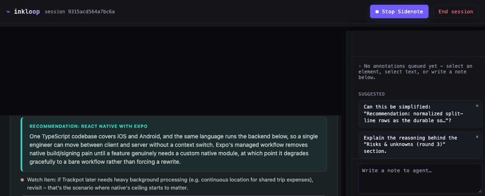

# inkloop

[](https://github.com/seemantshekhar43/inkloop/actions/workflows/ci.yml)
[](LICENSE)

**Agents write HTML now. inkloop is how you talk back to it - point at what's wrong, say why, done.**

An agent hands you a plan, a comparison, a mockup, a diagram as static HTML, and the review loop still
falls back to screenshots and prose for "here's what to change." inkloop keeps the interactivity: click
the thing that's wrong, say what's wrong with it, and the agent picks it up automatically - no accounts,
no cloud dependency in the core loop.



## Why

- **Local-first** - a local CLI and browser tab carry the whole feedback loop; no accounts, no server,
  no cloud dependency in the core loop.
- **Direct annotation** - point at an element or select a range of text, attach a comment, queue as many
  as you want, send them back in one round; the agent long-polls and revises in place, with live reload
  preserving your scroll position and any unsent draft.
- **Content guidance built in** - `inkloop stencil` ships fit/layout/rules for eight common content
  shapes (plan, comparison, table, report, mockup, diagram, code, plus a shared visual-design baseline),
  so the agent isn't starting from a blank page on either content or design.

## Installation

Requires Node.js >= 18.17.0. No other runtime dependencies.

The primary workflow needs no install at all - `npx -y inkloop <html-file>` (below) fetches and runs the
latest published version on demand, which is how the Claude Code skill and most agent integrations invoke
it. To install it explicitly instead:

```
npm install --global inkloop     # available as `inkloop` on PATH
# or, inside a project:
npm install --save-dev inkloop   # available via `npx inkloop` or an npm script
```

## Quick start

```
npx -y inkloop <html-file>
```

This starts a local server, prints a session URL to open in a browser, and works identically whether
it's invoked by a human, a Claude Code skill, or any other agent shelling out to it - the CLI and the
served artifact don't care what wrote the HTML. `inkloop --help` documents the full command set (`poll`,
`end`, `stop`, `stencil`, `--reopen`).

Convention: write the artifact under a project-local `.inkloop/` directory (e.g.
`.inkloop/plan-comparison.html`), rather than an arbitrary scratch location. This is not enforced by
the tool - inkloop keys the session off the file's absolute path, so any location works - but it
keeps artifacts visible in the project tree and easy to gitignore. This is unrelated to inkloop's own
session state (feedback, round history), which always lives under `~/.inkloop/<hash-of-absolute-path>/`
regardless of where the artifact itself is written - see [Tech stack](#tech-stack) below.

## Core loop

```
agent writes .inkloop/artifact.html
  → inkloop <file>            (opens/resumes a browser session)
  → human annotates elements / text ranges, queues feedback
  → inkloop poll <file>       (agent long-polls, blocks until feedback arrives)
  → agent revises artifact.html
  → live reload, preserving scroll position and unsent draft state
  → repeat until inkloop end <file>
```

Also ships `inkloop stencil <id>`: authoring-time content-guidance for the eight content shapes inkloop
reviews well (`plan`, `comparison`, `table`, `report`, `mockup`, `diagram`, `code`, plus the cross-cutting
`loopable`), each with fit/layout/rules/snags, and a shared `design_baseline` visual-design floor - font
stack, spacing, palette, component examples, a theming mechanism, and a concrete pinned
CDN-component-library default - for when there's no user-specified or subject-matched design system to
follow instead. Run `inkloop stencil` with no id for the full list.

## Using it with an agent

### Claude Code

[`skills/inkloop/SKILL.md`](skills/inkloop/SKILL.md) packages the core loop above as a Claude Code
skill, so the agent recognizes when an HTML artifact is worth putting through inkloop and knows the
exact command sequence (`inkloop stencil <id>` for content-guidance before writing the HTML, then
`inkloop`, `inkloop poll --agent-reply`, `inkloop end`) without re-deriving it from `--help` each
session. This is the most complete onboarding path today; the skill file itself is agent-agnostic
prose and worth reading even when using a different client.

### GitHub Copilot, Cursor, and other agents

inkloop doesn't yet package equivalents of Claude Code's skill format for other clients. Until it
does, point the agent at [`skills/inkloop/SKILL.md`](skills/inkloop/SKILL.md)'s Workflow section
directly - most agents can be told to read a file's instructions and follow them for the rest of a
session - or paste the workflow steps into a project instructions file the agent already loads
(`.cursor/rules`, `.github/copilot-instructions.md`, etc.). The commands themselves are identical
across clients; only how the agent learns to reach for them differs.

## Rendering diagrams in an artifact

An artifact can already bring its own self-contained Mermaid diagram - a `.mermaid` block plus a
CDN-imported render call - and it renders identically whether opened through `inkloop <file>` or as a
standalone `.html` file, no inkloop support needed. If the artifact also supports a dark-mode/theme
toggle (see the `design_baseline` theming mechanism above), the diagram should re-render on theme
change too, not just render once at whatever theme was active on first paint - see
[`AGENTS.md`](AGENTS.md#rendering-diagrams-in-an-artifact-no-inkloop-support-needed) for a verified
working example of both.

## Tech stack

- **CLI / local server:** Node.js + TypeScript on `node:http` (no framework)
- **Injected browser SDK:** vanilla TypeScript, single IIFE, zero runtime dependencies
- **Transport:** plain HTTP long-poll, ~30s bounded, no WebSocket
- **Agent-facing output:** `inkloop poll`/`inkloop end` print TOON (toonformat.dev) instead of JSON, cutting agent-side token usage measurably vs. plain JSON on this project's own poll/end traffic
- **Persistence:** flat JSON under `~/.inkloop/<hash-of-absolute-path>/`
- **Packaging:** single npm package (CLI, server, and SDK bundled together)

## v1 scope

Deliberately deferred to a later version, to keep the open → annotate → queue → poll → revise → reload
loop simple:

- A passive layout/QA issue inbox.
- Editable Mermaid whiteboards - inkloop only supports static Mermaid rendering via the artifact's own
  script (see [Rendering diagrams in an artifact](#rendering-diagrams-in-an-artifact) above).

## Contributing

See [`CONTRIBUTING.md`](CONTRIBUTING.md) for local setup, running the test/lint/build commands, and
exercising the CLI end to end.

## License

MIT - see [`LICENSE`](LICENSE).
